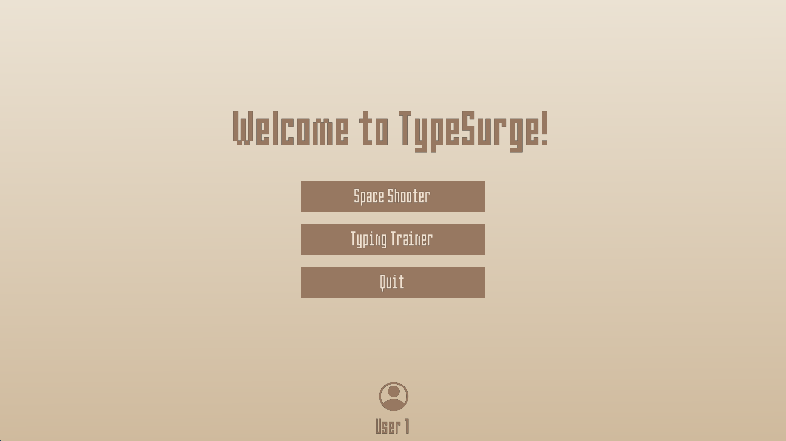
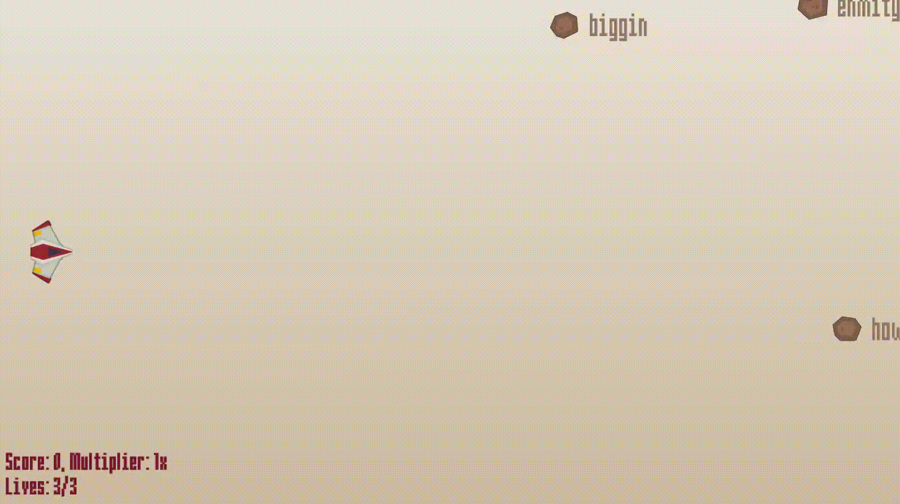
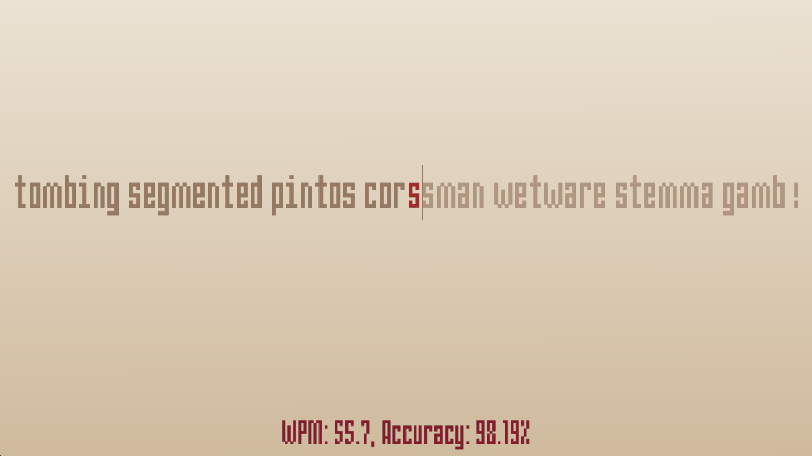
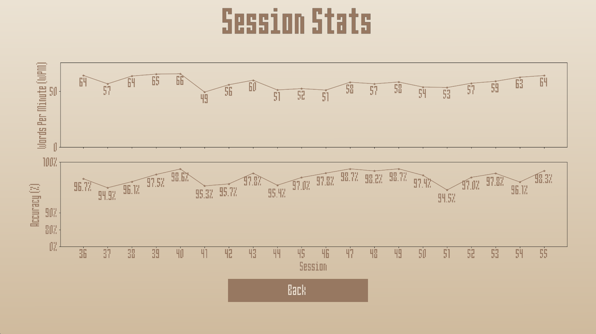

# TypeSurge

A typing game built with the Python `arcade` library.



## Playing the game - Windows users

If you're a Windows user, you can directly grab the release to play the game. Follow these steps:
1. Go to `Releases` on this repo (on the right pane).
2. From the latest release, select the `Assets` dropdown.
3. Download `typesurge_windows.zip`.
4. Unzip the file.
5. Go to the `typesurge` folder and open `typesurge.exe`.

## Playing the game - running from the source (python)

First, you'll need to clone the repository to your local machine. You can do this by running the following command in your terminal:

```bash
git clone https://github.com/deepak-ramamohan/typing-game.git
```

Alternatively, you can go to `Releases` on this repo and get the source code from there (`Assets` dropdown -> `Source Code.zip`).

Once you have cloned the repository, you'll need to set up a Python environment.

### Setting up a Python Environment

You can follow the instructions [here](https://www.anaconda.com/docs/getting-started/miniconda/install) for installing miniconda (recommended).

Once done, you can create a new environment and install dependencies with the following commands:

```bash
# Create a new conda environment with Python 3.12
conda create --name typesurge python=3.12

# Activate the environment
conda activate typesurge

# Install the required dependencies
pip install -r requirements.txt
```

### Running the Game

Once you have set up the environment and installed the dependencies, navigate to the folder you cloned (`typing-game`) from your terminal. You can now run the game with the following command:

```bash
python main.py
```

## Game Modes

### Space Shooter

A fast-paced arcade game where you must type words to shoot down enemy meteors. The difficulty ramps up as your score gets higher.



### Typing Trainer

A training mode that helps you improve your typing skills. It tracks your words-per-minute (WPM) and accuracy. This mode intelligently selects words that you have previously mistyped to help you practice and improve on your weaknesses.



